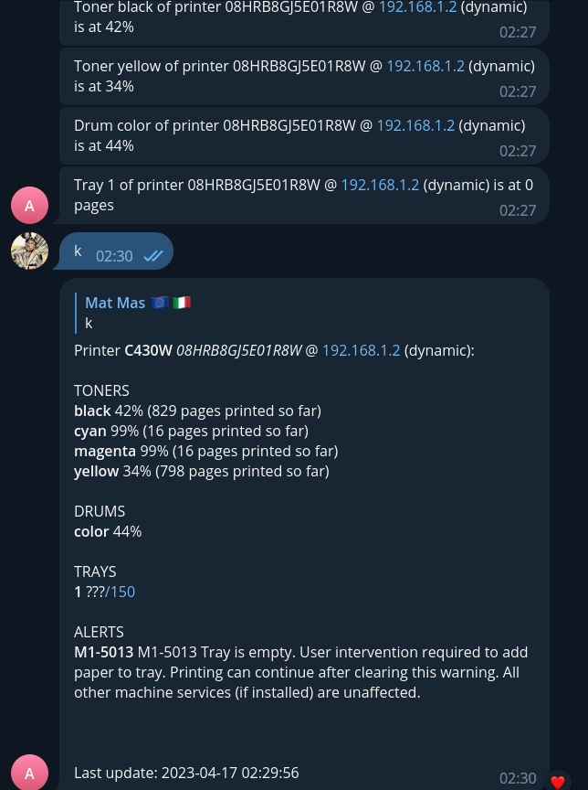

# SyncThru Telegram Bot





Receive alerts on your ink, tray, and drum levels of SyncThru-enabled Samsung printers on Telegram, and check their status.


## Installation

Simply clone the repository or download the files, the install requirements with

```
pip install -r requirements.txt
```

## Usage

Create a bot with [@BotFather](https://t.me/BotFather) and copy its token into the config.

You need to run `main.py` for information polling and level messages
and `telegram.py` for the checking feature

A printer may be configured as a static-ip or a dynamic-ip printer, in which case the software will attempt to find its local ip given its serial number

Do not edit the `store.json` file if you do not know what you are doing, or you may crash the whole thing.

## Configuration

Here is an explainer

```json
{
    "printers": [
        {
            "ip": "192.168.1.2", // initial (or static) iè
            "serial_num": "08HRB8GJ5E01R8W", // serial number
            "dynamic_ip": true, // whether the ip is dynamic
            "toner": true, // enables toner alerts
            "drum": true,// enables drum alerts
            "tray": true, // enables tray alerts
            "alert_levels": [50, 20, 5] // the critical levels to which the alerts must be dispatched
        }
    ],
    "update_interval": 600000, // how many seconds between updates
    "telegram_bot_token": "123443:AAFG0kwfF92fds32sp92d", // the telegram token
    "telegram_user_id": 153325233 // your telegram id, you can get it at https://t.me/username_to_id_bot
}
```
